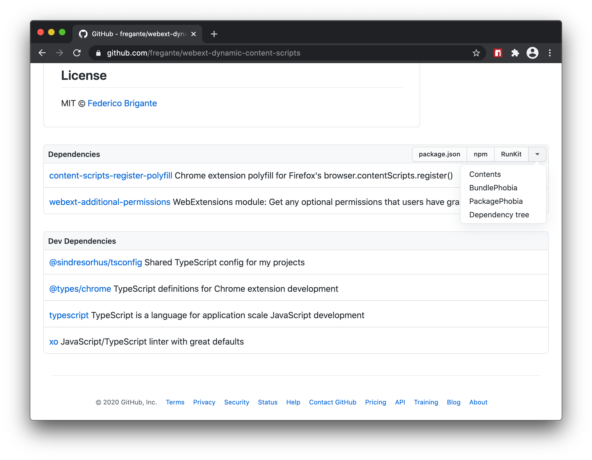

#  npmclub

<!-- HTML tags used so the description can be copy-pasted onto Mozilla Addons -->

On every GitHub repository or folder with a <code>package.json</code> file, scroll to the bottom of the page to see a list of its npm dependencies and their descriptions.

npmclub also adds convenient links to:

<ul>
	<li>the <b>package.json</b> file
	<li><b>npmjs.com</b>
	<li><b>RunKit</b> to test the package
	<li><b>BundlePhobia</b> to see the package size when bundled
	<li><b>PackagePhobia</b> to see the package size when installed
	<li><b>NPMGraph</b> to explore the sub-dependencies
	<li><b>UNPKG</b> to see the exact contents published to npm
</ul>

## Installation

[] and other Chromium browsers

[] including Firefox Android

[][link-safari] [][link-safari] on Mac, iOS and iPadOS

 _If you love npmhub, consider [sponsoring or hiring](https://github.com/sponsors/shanmuckh) the maintainer [@shanmuckh](https://github.com/shanmuckh)_

## Design

Here's what npmclub looks like:

